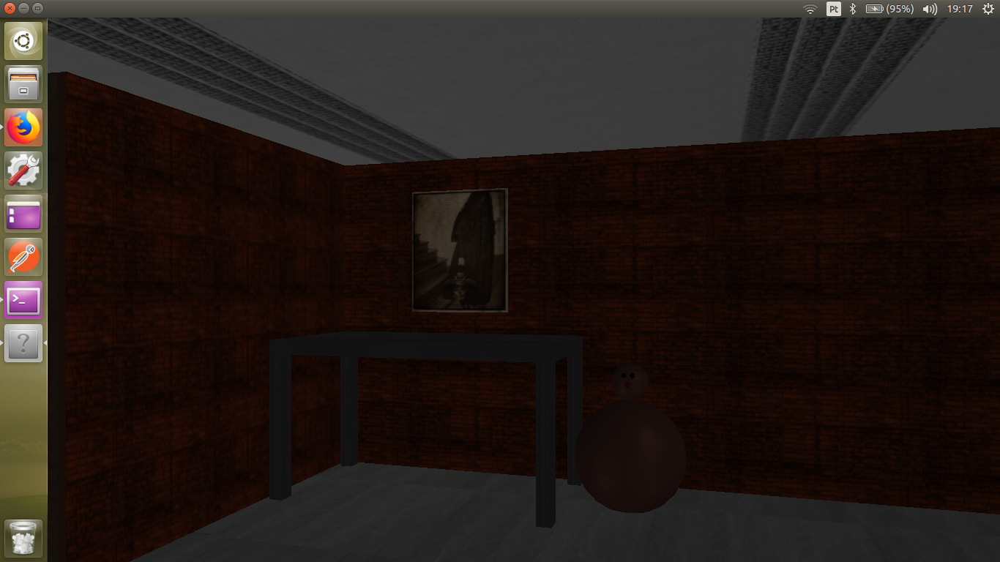
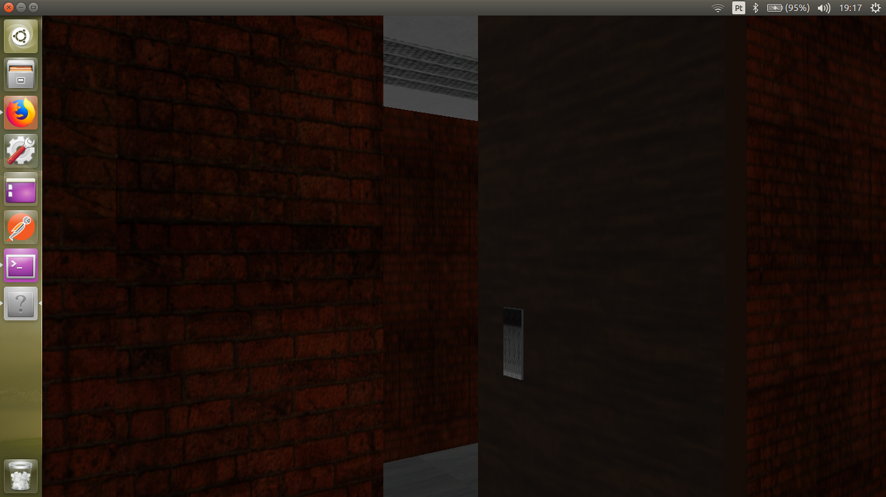
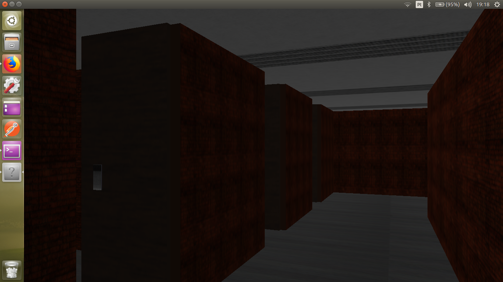

# TerrorOnTheHouse

Toolkit: OpenGL | Glut | Computer Graphic | C++

This repository contains the final project of the Computer Graphic discipline. The project consist of a terror game demonstration in the first person inspired for Amnesia game and PT. The objective of demo is to immerse the player in a terror environment located inside at the one maze which was cursed. 

## Requiriments ##

- [A Unix Environment](https://www.ubuntu.com/) :white_check_mark:
- [C++ Compiler with support for standard C11]() :white_check_mark:
- [OpenGL]() :white_check_mark:

## External Dependencies ##
```sh
 apt-get install build-essential
 apt-get install freeglut3-dev
 apt-get install libsoil-dev
 apt-get install libglm-dev
```
## Build Instructions

1. Clone the project.

2. Move to the desired folder

3. Invoke the makefile

```
$ git clone https://github.com/ThiagoLuizNunes/TerrorOnTheHouse.git
$ cd TerrorOnTheHouse/
$ make 
```
## Execution Instructions ##
* In the TerrorOnTheHouse/bin.
* Run the created executable file.

```
$ ./terror-project
```
## Screenshots ##

<p align="center">
	<br>
	
	<h5 align="center">Figure 1</h5>
	<br>
</p>
<p align="center">
	<br>
	
	<h5 align="center">Figure 2</h5>
	<br>
</p>
<p align="center">
	<br>
	
	<h5 align="center">Figure 3</h5>
	<br>
</p>

## Authors ##

* Thiago Luiz Pereira Nunes ([ThiagoLuizNunes](https://github.com/ThiagoLuizNunes)) thiago.luiz@lavid.ufpb.br
* Leandro Mendes dos Santos ([Leandro Mendes dos Santos](https://github.com/LeandroUFPB)) leandro.mendes@eng.ci.ufpb.br

## License

This project is licensed under the MIT License - see the [LICENSE.md](LICENSE.md) file for details

>Created By **[ThiagoLuizNunes](https://www.linkedin.com/in/thiago-luiz-507483112/)** 2017.

---
```
